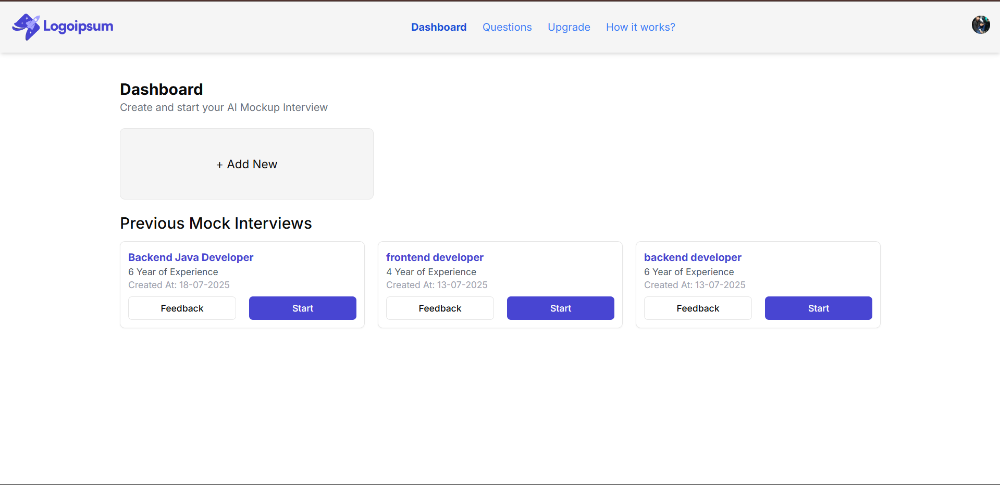
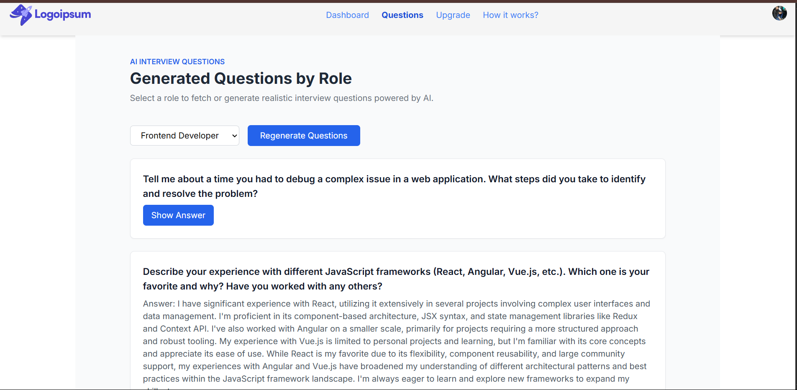
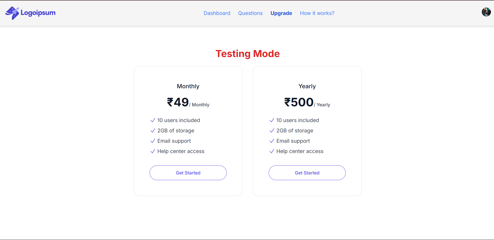
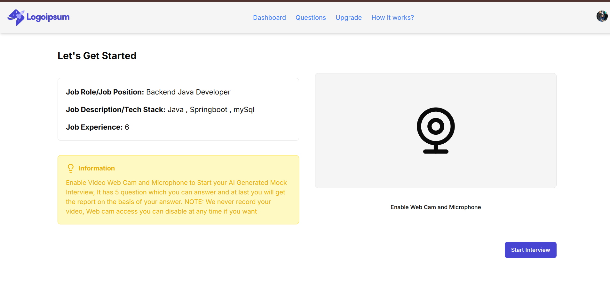
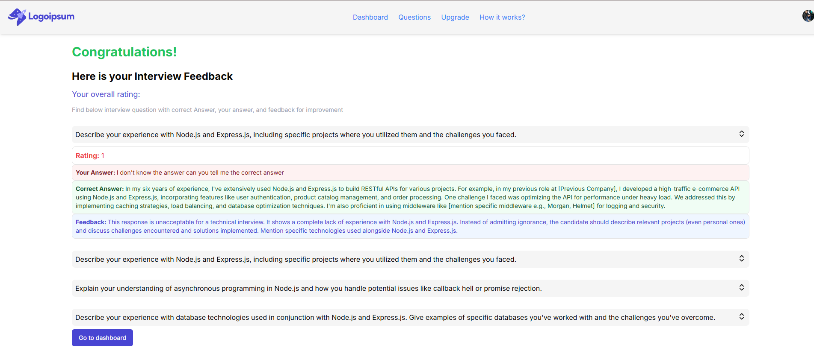

# 🧠 AI Interview Prep Platform

An intelligent, AI-powered platform designed to simulate mock interviews, provide personalized feedback, and help candidates prepare for technical interviews more effectively.

---

## 🌐 Live Demo

🔗 **Website:** [Visit the Platform](https://ai-interview-prep-platform.vercel.app)

---

## 📌 Features

- 🎯 **Personalized Mock Interviews** - Tailored interview experiences based on your role and experience level
- 💬 **AI-Generated Interview Questions** - Smart question generation using GPT-4
- ✍️ **Real-time Answer Input** - Seamless answer submission interface
- 📊 **Instant AI Feedback with Scoring** - Get detailed feedback and performance scores
- 🔁 **Practice Mode for Reattempts** - Practice as many times as you need
- 👤 **User Authentication via Clerk** - Secure login and session management
- 📈 **Dashboard to View Past Interviews & Feedback** - Track your progress over time

---

## 🧪 Screenshots

> Screenshots are saved in `public/screenshots/` directory.

| Dashboard | Questions | Upgrade | Interview | Feedback |
|-----------|-----------|---------|-----------|----------|
|  |  |  |  |  |

---

## 📁 Project Structure

```
app/
├── dashboard/
├── interview/
│   └── [interviewId]/
│       ├── start/
│       ├── questions/
│       └── feedback/
components/
├── ui/
lib/
├── utils/
public/
├── screenshots/
```

---

## ⚙️ Tech Stack

### **Frontend:**
- ✅ Next.js 14 (App Router)
- ✅ React
- ✅ Tailwind CSS
- ✅ Shadcn/UI
- ✅ TypeScript
- ✅ Lucide Icons

### **Backend:**
- 🤖 OpenAI GPT-4 (AI Interviewer)
- 🛢️ PlanetScale (MySQL DB)
- 🔧 Drizzle ORM
- 🔐 Clerk for Authentication
- 🧪 Zod for Validation

---

## 🚀 Getting Started

### 1️⃣ Clone the Repository

```bash
git clone https://github.com/AbuTalha7860/ai-interview-prep-platform.git
cd ai-interview-prep-platform
```

### 2️⃣ Install Dependencies

```bash
npm install
```

### 3️⃣ Configure Environment Variables

Create a `.env` file at the root with the following:

```env
OPENAI_API_KEY=your_openai_key
DATABASE_URL=your_database_url
CLERK_PUBLISHABLE_KEY=your_clerk_publishable_key
CLERK_SECRET_KEY=your_clerk_secret_key
```

### 4️⃣ Run the Development Server

```bash
npm run dev
```

Your app will be running at: **http://localhost:3000**

---

## 🧠 How It Works

1. **User Selection** - User selects experience level and role
2. **Question Generation** - GPT-4 generates role-specific interview questions
3. **Real-time Interaction** - User submits answers in real-time
4. **AI Evaluation** - GPT-4 evaluates answers and returns personalized feedback
5. **Progress Tracking** - Dashboard displays the interview summary and history

---

## 🧰 Tools & Services

- 🌐 **Vercel** – Hosting & Deployment
- 🧠 **OpenAI** – Question & Feedback Generation
- 🗄️ **PlanetScale** – Serverless MySQL Database
- 💼 **Clerk** – Authentication & Session Management
- 🎨 **Tailwind CSS** – Styling Framework
- 💬 **Lucide** – Icon Library

---

## 🤝 Contributing

Contributions are welcome! Please feel free to submit a Pull Request.

1. Fork the project
2. Create your feature branch (`git checkout -b feature/AmazingFeature`)
3. Commit your changes (`git commit -m 'Add some AmazingFeature'`)
4. Push to the branch (`git push origin feature/AmazingFeature`)
5. Open a Pull Request

---

## 📝 Future Enhancements

- 🎥 Video interview simulation
- 📚 Interview question bank expansion
- 📱 Mobile app development
- 🏆 Achievement system
- 👥 Peer-to-peer practice sessions

---

## 🧑‍💻 Author

**Abu Talha**
- Final Year B.Tech CSE Student | Full Stack Developer | AI Enthusiast
- 📫 **GitHub:** [@AbuTalha7860](https://github.com/AbuTalha7860)

---

## 📄 License

This project is licensed under the MIT License - see the [LICENSE](LICENSE) file for details.

---

## ⭐ Show Your Support

If you found this project helpful, please give it a ⭐ on GitHub!

---

## 📞 Contact

Have questions or suggestions? Feel free to reach out or open an issue on GitHub.

---

<div align="center">
  <strong>Made with ❤️ by Abu Talha</strong>
</div>
